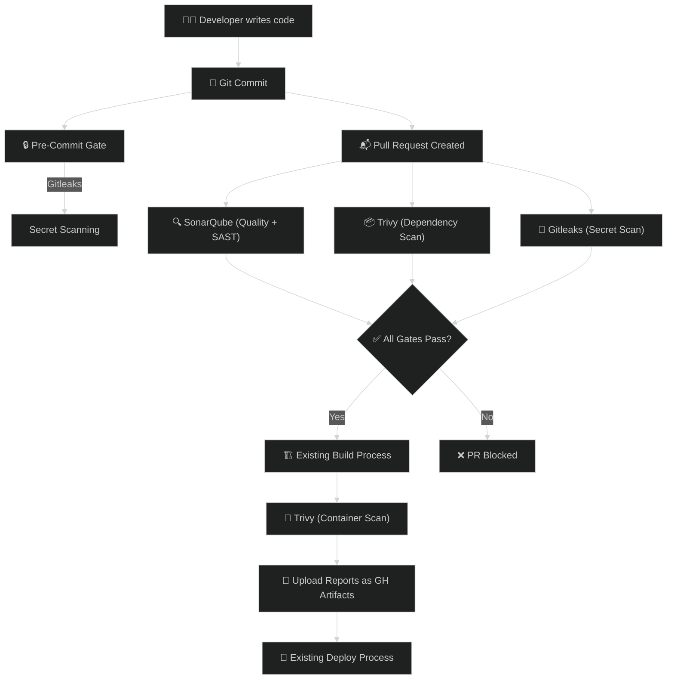
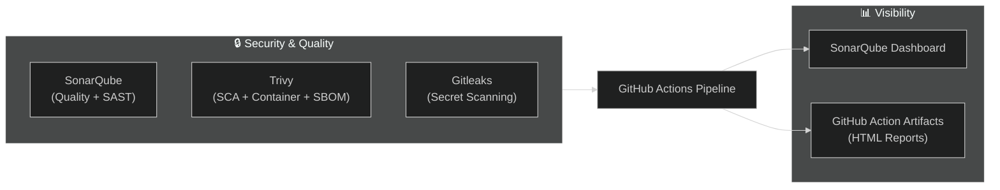
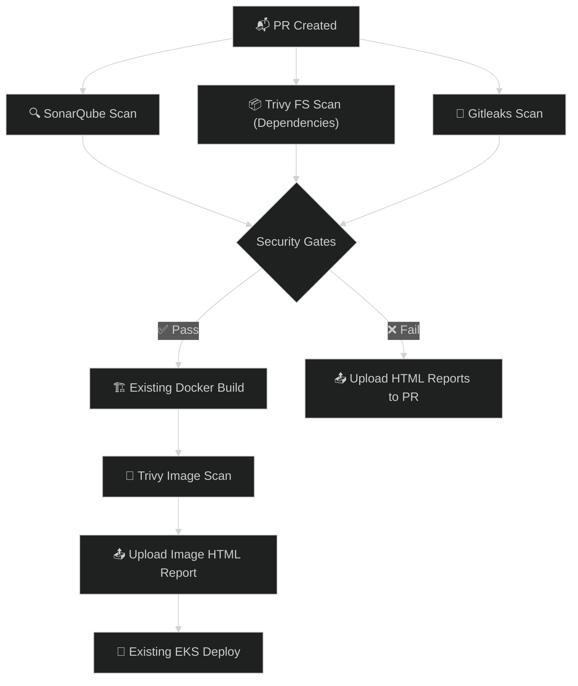
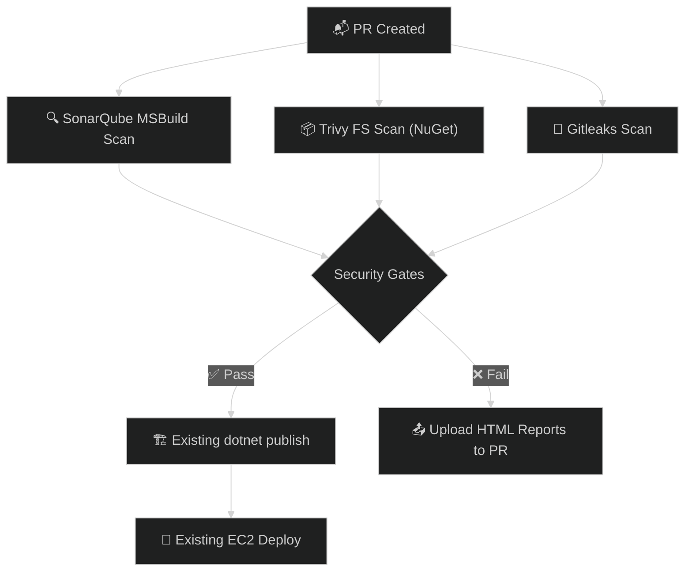

# Bajaj Capital — DevSecOps Architecture & Tool Selection

> Based on the MOM discovery call. This document covers: **Security Tooling**, **Code Quality**, **Branching Strategy**, and **Pipeline Architecture** for ~70 active repos across .NET, Angular, Node.js, React, and Python.

---

## 1. The Big Picture: What We're Building

Right now, Bajaj Capital has **zero quality gates** in their pipelines. The CI/CD pipelines (Build & Deploy) are already functioning via GitHub Actions. Our job is to inject DevSecOps without overcomplicating their workflow.

Here is the streamlined security stack we need to introduce:



---

## 2. Tool Selection (Streamlined Approach)

We are intentionally keeping the tool stack as simple and consolidated as possible.

### 2.1 Code Quality & SAST (Static Analysis)

| Tool | Purpose | Why Pick It |
|------|---------|-------------|
| **SonarQube** ⭐ | Code Quality + SAST | Replaces 5 different linters and SAST tools. Provides a single web dashboard for developers to see code smells, bugs, and security vulnerabilities. |

**Implementation Note:** We will need to stand up a **SonarQube Community Edition** server on an EC2 instance. This gives the client a beautiful dashboard for all 70 repos without paying for enterprise licenses.

### 2.2 SCA (Software Composition Analysis) & Container Scanning

| Tool | Purpose | Why Pick It |
|------|---------|-------------|
| **Trivy** ⭐ | Dependency Scanning + Image Scanning + SBOM | The undisputed king of open-source scanning. One CLI tool that can scan `npm`/`nuget` packages, generate SBOMs, AND scan the final Docker image. |

### 2.3 Secret Scanning

| Tool | Purpose | Why Pick It |
|------|---------|-------------|
| **Gitleaks** ⭐ | Secret Scanning | Lightweight, runs in seconds, catches AWS keys, passwords, and API tokens before they get merged. |

### 2.4 The Reporting Question: Do we need DefectDojo?

**Short Answer:** No, not on day one. We want to avoid tool fatigue.

**How we handle reporting without DefectDojo:**
1. **SonarQube:** Has its own dashboard. Developers will go there to see their code quality and SAST issues. This covers 50% of our reporting needs natively.
2. **Trivy & Gitleaks:** We will configure the GitHub Actions pipeline to output results in **HTML format**. If the pipeline fails, the HTML report is uploaded as a **GitHub Artifact**. The client can simply click "Download" on the failed GitHub Action to see exactly what dependencies or secrets caused the failure.

---

## 3. The Final Tool Stack (Summary)



---

## 4. Pipeline Architecture — How It All Connects

Since the client already has Checkout and Deploy steps, we are simply injecting a "Security Job" into their existing flow.

### For EKS Apps (Containers)



### For .NET Apps (Windows EC2)



---

## 5. Centralized Action Architecture

We will still use a centralized repo so we don't have to copy/paste security steps into 70 repos.

```
bajaj-capital-org/
├── shared-actions/                    ← Central repo (new)
│   ├── .github/
│   │   ├── actions/
│   │   │   ├── run-sonarqube/         ← Composite action for Sonar
│   │   │   ├── run-trivy-fs/          ← Composite action for dependencies
│   │   │   ├── run-trivy-image/       ← Composite action for docker images
│   │   │   └── run-gitleaks/          ← Composite action for secrets
│   └── README.md
```

---

## 6. Pipeline Optimization & Caching Strategy

With ~70 repositories and multiple security scans running per Pull Request, pipeline execution speed is critical. We will implement caching at multiple layers to drastically reduce build times.

### 6.1 Dependency Caching (The Standard)
Every composite action (`run-sonarqube`, `run-trivy-fs`, etc.) will utilize `actions/cache` to store downloaded packages.
- **Node.js**: Cache `~/.npm` or `node_modules` based on `package-lock.json` hash.
- **.NET**: Cache `~/.nuget/packages` based on `packages.lock.json` hash.
- **Python**: Cache `~/.cache/pip`.

### 6.2 Trivy Database Caching
Trivy downloads a vulnerability database before scanning. Downloading this on every run adds 1-2 minutes and risks hitting rate limits. 
- We will cache the Trivy DB directory (`~/.cache/trivy`) using `actions/cache`. The cache key will rotate every 12-24 hours to ensure the database stays up-to-date without downloading it on every single PR.

### 6.3 Docker Layer Caching
Since EKS apps require Docker builds, we must avoid rebuilding identical layers (like `npm install`). 
- We will use Docker's `inline` cache or `registry` cache (pushing cache layers to AWS ECR) using `--cache-from` and `--cache-to`. This speeds up container builds by 50-80%.

### 6.4 "Namespace Caching" Explained
You mentioned **Namespace Caching**. In GitHub Actions, caches are fundamentally **scoped (namespaced) by branch**. 
- **How it works:** A PR branch (`feature/login`) can read caches created by itself, OR caches created by its base branch (`main`). It *cannot* read caches from `feature/dashboard`. 
- **Is it fast?** Yes! This is a security and performance feature built natively into GitHub. It ensures that pulling a cache is incredibly fast (since it's on GitHub's internal network) and prevents "cache poisoning" (where one branch corrupts the cache for another). 
- **Key Namespacing Strategy:** We will explicitly namespace our cache keys in the centralized actions to avoid collisions. For example: `${{ runner.os }}-node-${{ hashFiles('**/package-lock.json') }}`.

---

## 7. Severity Policy & Gates

We will enforce the following thresholds for blocking PRs:

| Tool | Block PR? | Threshold | Reporting |
|------|-----------|-----------|-----------|
| **SonarQube** | Yes | Quality Gate Fails (e.g., Code Smell > A, or Critical Vuln) | Sonar Dashboard |
| **Trivy (Dependencies)** | Yes | `CRITICAL`, `HIGH` | GitHub Artifact (HTML) |
| **Trivy (Image)** | Yes | `CRITICAL`, `HIGH` | GitHub Artifact (HTML) |
| **Gitleaks** | Yes | Any secret match | GitHub Artifact (HTML) |
